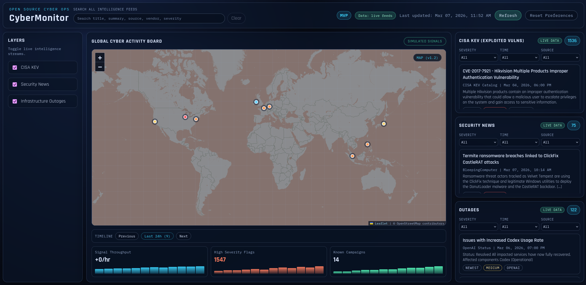

# CyberMonitor

CyberMonitor is a free, no-login cybersecurity intelligence dashboard designed for static hosting.

It runs with plain HTML, CSS, and JavaScript and is intentionally compatible with:

- GitHub Pages
- any static host
- local development without a backend

## Preview


## v1.3 Highlights

- real feed ingestion adapters for:
  - CISA KEV
  - security news RSS sources
  - public status/outage feeds
- shared normalization utilities for adapters (`scripts/adapters/lib`)
- single feed generation runner (`scripts/generate-feeds.js`)
- frontend feed-source transparency badges (`LIVE DATA`, `SAMPLE DATA`, mixed/partial states)
- static-safe fallback remains intact (`data/*.sample.json`)

## Core Architecture

- `frontend/`: static UI shell and browser-side rendering
- `data/`: generated feed outputs and sample fallback data
- `scripts/`: optional ingestion/generation tooling (not required at runtime)

No backend server is required for the base product.

## Data Flow (v1.3)

1. Run `node scripts/generate-feeds.js`.
2. Adapters fetch public feeds and normalize to a shared schema.
3. Adapters write generated files:
   - `data/kev.json`
   - `data/news.json`
   - `data/outages.json`
4. Frontend attempts generated files first.
5. If generated files are missing/unavailable, frontend falls back to sample files:
   - `data/kev.sample.json`
   - `data/news.sample.json`
   - `data/outages.sample.json`

This keeps the dashboard usable in static and offline-first workflows.

## Run The Dashboard

### Option 1: quick local open (sample-first)

1. Open the repo.
2. Open `frontend/index.html` directly.

### Option 2: local static server (recommended for production-like behavior)

Serve the repo root with any static file server, then open `frontend/index.html` through HTTP.

## Generate Live/Current Feeds

Node.js 18+ is recommended.

```bash
node scripts/generate-feeds.js
```

Optional subset generation:

```bash
node scripts/generate-feeds.js --only kev
node scripts/generate-feeds.js --only news,outages
```

You can also run individual adapters:

```bash
node scripts/adapters/kev_adapter.js
node scripts/adapters/news_adapter.js
node scripts/adapters/outages_adapter.js
```

## Public Sources Used In v1.3

- KEV: CISA Known Exploited Vulnerabilities feed
- News:
  - BleepingComputer RSS
  - Dark Reading RSS
  - Krebs on Security RSS
- Outages:
  - GitHub Status RSS
  - OpenAI Status RSS
  - Discord Status RSS
  - Cloudflare Status RSS

No API keys are required for the base v1.3 pipeline.

## Feed Source Indicators In UI

The dashboard now shows generated-vs-sample mode in two places:

- global top-bar badge (live, sample fallback, mixed, partial)
- per-panel feed badge (live, sample, unavailable)

This makes it clear whether the wallboard is showing generated feeds or sample fallback data.

## Normalized Feed Schema

All panel feeds normalize to this shape:

```json
{
  "id": "string",
  "title": "string",
  "source": "string",
  "published": "ISO-8601 string",
  "url": "string",
  "summary": "string",
  "severity": "LOW | MEDIUM | HIGH | CRITICAL",
  "vendor": "string",
  "tags": ["string"]
}
```

Adapters may include extra fields when useful, while preserving frontend compatibility.

## Project Structure

```text
CyberMonitor/
|- frontend/
|  |- index.html
|  |- styles.css
|  |- app.js
|- data/
|  |- kev.sample.json
|  |- news.sample.json
|  |- outages.sample.json
|  |- map.overlays.sample.json
|  |- metrics.sample.json
|  |- fallback.sample.js
|  |- kev.json            # optional generated output
|  |- news.json           # optional generated output
|  |- outages.json        # optional generated output
|- scripts/
|  |- README.md
|  |- generate-feeds.js
|  |- refresh-sample-timestamps.js
|  |- adapters/
|     |- kev_adapter.js
|     |- news_adapter.js
|     |- outages_adapter.js
|     |- lib/
|        |- normalize.js
|        |- rss.js
|- assets/
|  |- screenshots/
|     |- dashboard-v1.2.png
|- ROADMAP.md
|- CONTRIBUTING.md
|- README.md
```

## Documentation

- [ROADMAP.md](ROADMAP.md)
- [scripts/README.md](scripts/README.md)
- [CONTRIBUTING.md](CONTRIBUTING.md)
