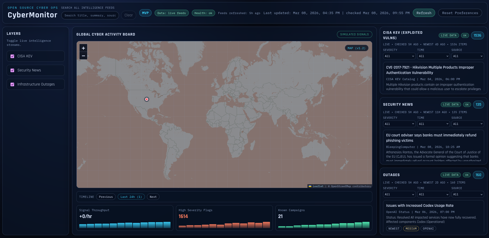

# CyberMonitor

CyberMonitor is a free, no-login cybersecurity intelligence dashboard designed for static hosting.

It runs with plain HTML, CSS, and JavaScript and is intentionally compatible with:

- GitHub Pages
- any static host
- local development without a backend

## Preview


## v1.4.1 Stability Highlights

- hardened generation pipeline with per-item validation, repair, dedupe, and predictable output handling
- safer partial-failure behavior: adapters run independently and can restore previously valid output when current output is unusable
- frontend resilience upgrades for missing metadata/health files, malformed feed items, and stale feed states
- clearer freshness semantics in panels (`checked` vs `newest`) to separate pipeline freshness from source publish cadence
- hardened scheduled workflow behavior (idempotent no-change runs, per-ref concurrency, timeout guardrails, run summary output)
- static-host compatibility preserved with generated-first and sample-data fallback behavior

## v1.4 Foundation

- scheduled feed generation with GitHub Actions cron + manual dispatch
- generated feed metadata and health reporting (`feed-metadata.json`, `feed-health.json`)
- expanded public source coverage for news and outage/status feeds
- generated map-correlation overlays (`map.correlated.json`) derived from ingested feeds
- frontend freshness and health indicators in the top bar and panel headers
- sample-data fallback remains intact for static compatibility

## Core Architecture

CyberMonitor now operates in four layers:

- UI layer: `frontend/` static dashboard shell and browser rendering
- normalized data layer: `data/` generated feed artifacts + sample fallbacks
- generation layer: `scripts/` adapters and unified generator
- automation/observability layer: `.github/workflows/` scheduled generation + metadata/health outputs

No backend server is required for the base product.

## Data Flow (v1.4.1)

1. Generate feeds manually (`node scripts/generate-feeds.js`) or via scheduled workflow.
2. Adapters ingest public sources and normalize records to CyberMonitor schema.
3. Generator validates/repairs/dedupes adapter output and preserves previous good output when needed.
4. Generator writes feed files:
   - `data/kev.json`
   - `data/news.json`
   - `data/outages.json`
5. Generator writes observability files:
   - `data/feed-metadata.json`
   - `data/feed-health.json`
6. Generator writes derived map overlays:
   - `data/map.correlated.json`
7. Frontend attempts generated files first, then falls back to sample data where applicable.

## Scheduled Feed Automation

Workflow: `.github/workflows/generate-feeds.yml`

- triggers:
  - manual: `workflow_dispatch`
  - scheduled: `15 */3 * * *` (every 3 hours)
- runtime:
  - Node 20 setup
  - optional npm dependency install when `package.json` exists
  - `node scripts/generate-feeds.js`
- commit behavior:
  - stages generated artifacts with explicit add/remove tracking
  - commits only when changes are detected
  - no-op runs skip commit/push cleanly
  - bot commit message: `chore: refresh generated intelligence feeds`
  - writes run summary with changed artifacts and published commit SHA
- operational safety:
  - per-ref workflow concurrency guard
  - job timeout set to 15 minutes

Baseline v1.4/v1.4.1 automation does not require custom secrets.

## Run The Dashboard

### Option 1: quick local open (sample-first)

1. Open the repo.
2. Open `frontend/index.html` directly.

### Option 2: local static server (recommended)

Serve the repo root with any static file server, then open `frontend/index.html` through HTTP.

## Generate Feeds Manually

Node.js 18+ is recommended.

```bash
node scripts/generate-feeds.js
```

Optional subset generation:

```bash
node scripts/generate-feeds.js --only kev
node scripts/generate-feeds.js --only news,outages
```

## Frontend Fallback Behavior

Panel feed load order:

- KEV: `data/kev.json` -> `data/kev.sample.json`
- News: `data/news.json` -> `data/news.sample.json`
- Outages: `data/outages.json` -> `data/outages.sample.json`

Map overlay load order:

- `data/map.correlated.json` -> `data/map.overlays.sample.json`

If generated files are unavailable, the dashboard remains usable with sample data.

## UI Observability Signals

Top bar now includes:

- data mode indicator (live/sample/mixed/partial)
- feed health indicator
- feed refresh recency summary

Each panel includes:

- source mode badge (`LIVE DATA`, `SAMPLE DATA`, `NO DATA`)
- health chip (`OK`, `WARN`, `ERROR`)
- freshness/meta line (`checked ...`, `newest ...`, item count)
- stale states that are surfaced as subtle warning labels instead of hard errors

## Public Sources Used In v1.4

KEV source:

- CISA Known Exploited Vulnerabilities feed

News sources:

- BleepingComputer RSS
- Dark Reading RSS
- Krebs on Security RSS
- The Hacker News RSS
- SANS ISC RSS

Outage/status sources:

- GitHub Status RSS
- OpenAI Status RSS
- Discord Status RSS
- Cloudflare Status RSS
- Slack Status RSS
- Atlassian Status RSS
- Heroku Status RSS

No API keys are required for base v1.4 ingestion.

## Stability Notes (v1.4.1)

- Adapter-level failures do not automatically terminate generation for healthy feeds.
- Validation issues are recorded in `feed-health.json` and surfaced in UI observability labels.
- Generated timestamps and source publish timestamps are shown separately in panel metadata:
  - `checked`: pipeline freshness / last successful feed check
  - `newest`: newest event/article timestamp from that source data
- Browser `Refresh` reloads current generated/sample files; it does not execute Node adapter scripts in-browser.

## Map Correlation Note

`data/map.correlated.json` is a derived visualization layer built from feed signals using deterministic approximation logic. It is not authoritative geolocation intelligence.

## Normalized Feed Schema

All panel feeds normalize to this shape:

```json
{
  "id": "string",
  "title": "string",
  "source": "string",
  "published": "ISO-8601 string",
  "url": "string",
  "summary": "string",
  "severity": "LOW | MEDIUM | HIGH | CRITICAL",
  "vendor": "string",
  "tags": ["string"]
}
```

Adapters may include extra fields when useful while preserving frontend compatibility.

## Project Structure

```text
CyberMonitor/
|- .github/
|  |- workflows/
|     |- deploy-pages.yml
|     |- generate-feeds.yml
|- frontend/
|  |- index.html
|  |- styles.css
|  |- app.js
|- data/
|  |- kev.sample.json
|  |- news.sample.json
|  |- outages.sample.json
|  |- map.overlays.sample.json
|  |- metrics.sample.json
|  |- fallback.sample.js
|  |- kev.json              # optional generated output
|  |- news.json             # optional generated output
|  |- outages.json          # optional generated output
|  |- feed-metadata.json    # generated metadata
|  |- feed-health.json      # generated health report
|  |- map.correlated.json   # generated map correlation overlay
|- scripts/
|  |- README.md
|  |- generate-feeds.js
|  |- refresh-sample-timestamps.js
|  |- adapters/
|     |- kev_adapter.js
|     |- news_adapter.js
|     |- outages_adapter.js
|     |- sources.js
|     |- lib/
|        |- normalize.js
|        |- rss.js
|- assets/
|  |- screenshots/
|     |- dashboard-v1.1.png
|     |- dashboard-v1.2.png
|     |- dashboard-v1.3.png
|- ROADMAP.md
|- CONTRIBUTING.md
|- README.md
```

## Documentation

- [ROADMAP.md](ROADMAP.md)
- [scripts/README.md](scripts/README.md)
- [CONTRIBUTING.md](CONTRIBUTING.md)

## Future Directions

CyberMonitor is now moving to track-based planning after v1.4.1 hardening:

- intelligence expansion: broader source coverage, better categorization, source-quality scoring
- map intelligence: stronger correlation methodology and clearer confidence signaling
- platform reliability: higher automation resilience, feed-quality guardrails, operational observability
- deployment/distribution: tighter Pages publishing cadence and future packaging options
