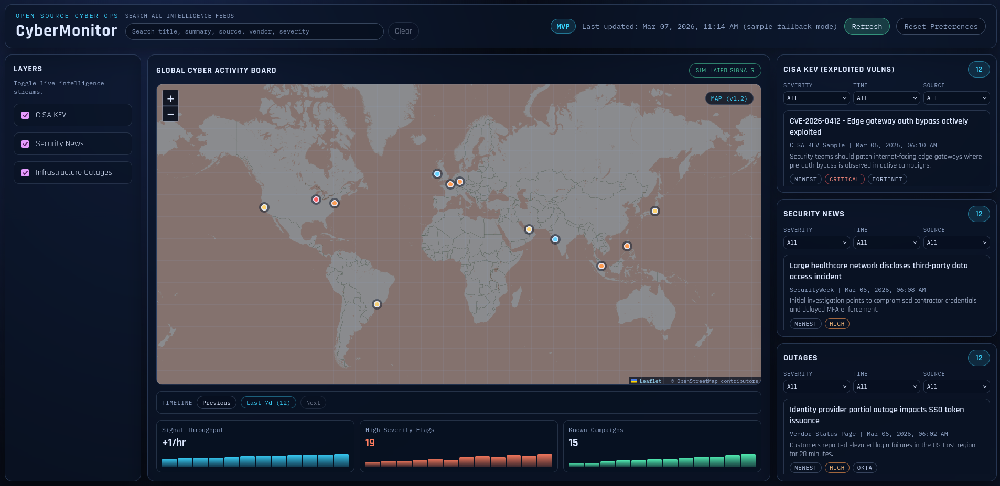

# CyberMonitor

CyberMonitor is a free, no-login cybersecurity monitoring dashboard designed for instant loading on static hosting.

It aggregates cybersecurity signals into a SOC-style wallboard focused on:

- exploited vulnerabilities (CISA KEV)
- security news
- infrastructure outages
- map-based threat signal visibility

## Preview


## v1.2 Highlights

- local preference persistence (`localStorage`) for layers, panel filters, global search, and timeline selection
- reset control to clear stored preferences and restore defaults
- map timeline stepping controls (`1h`, `6h`, `24h`, `7d`) with overlay re-rendering
- global browser-side search across KEV/news/outages (`title`, `summary`, `source`, `vendor`, `severity`)
- optional adapter script scaffolding for generated feeds while preserving static-host compatibility

## What This Dashboard Includes

- static frontend in plain HTML, CSS, and JavaScript
- no backend server and no required API keys
- center Leaflet world map with overlay categories and timeline filtering
- panel-level filtering by severity, time window, and source
- global search across all intelligence panels
- manual refresh control and last-updated indicator
- file-mode fallback support so `frontend/index.html` still renders when opened directly

## Feed Loading Model (v1.2)

For each feed panel, the frontend attempts generated feed files first, then sample files:

- KEV: `data/kev.json` -> `data/kev.sample.json`
- News: `data/news.json` -> `data/news.sample.json`
- Outages: `data/outages.json` -> `data/outages.sample.json`

If you never run adapters, the dashboard continues to work with sample files only.

## Run Locally

1. Open this repository folder.
2. Double-click `frontend/index.html`.
3. The dashboard loads with sample feed data.

Optional: serve the repo with any static server if you want strict browser behavior that mirrors production hosting.

## Optional Adapter Scripts

Adapters are optional tooling and are not required at runtime.

```bash
node scripts/adapters/kev_adapter.js
node scripts/adapters/news_adapter.js
node scripts/adapters/outages_adapter.js
```

These generate:

- `data/kev.json`
- `data/news.json`
- `data/outages.json`

## Project Structure

```text
CyberMonitor/
|- frontend/
|  |- index.html
|  |- styles.css
|  |- app.js
|- data/
|  |- kev.sample.json
|  |- news.sample.json
|  |- outages.sample.json
|  |- map.overlays.sample.json
|  |- metrics.sample.json
|  |- fallback.sample.js
|  |- kev.json            # optional generated output
|  |- news.json           # optional generated output
|  |- outages.json        # optional generated output
|- scripts/
|  |- README.md
|  |- refresh-sample-timestamps.js
|  |- adapters/
|     |- kev_adapter.js
|     |- news_adapter.js
|     |- outages_adapter.js
|- assets/
|  |- screenshots/
|     |- dashboard-v1.1.png
|- ROADMAP.md
|- CONTRIBUTING.md
|- README.md
```

## Data Contract

Each feed item uses:

- `id`
- `title`
- `source`
- `published` (ISO timestamp)
- `url`
- `summary`
- optional tags like `severity` and `vendor`

## Data Sources Disclaimer

- Data in this repository is sample/demo JSON under `data/`.
- Adapter scripts currently provide normalization scaffolding and local generation.
- Live production feed integrations remain optional and are not required for v1.2.

See full milestones in [ROADMAP.md](ROADMAP.md).

## Contributing

Contributor expectations and lightweight workflow are documented in [CONTRIBUTING.md](CONTRIBUTING.md).
