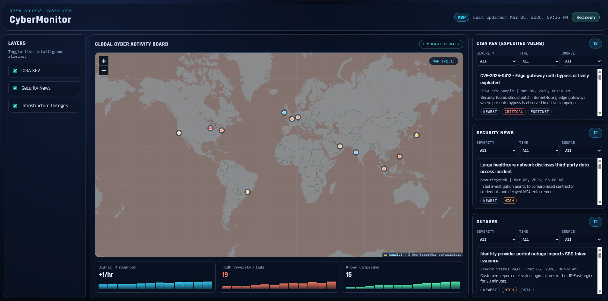

# CyberMonitor

CyberMonitor is a free, no-login cybersecurity monitoring dashboard designed for instant loading on static hosting.

It aggregates cybersecurity signals into a SOC-style wallboard focused on:

- exploited vulnerabilities (CISA KEV)
- security news
- infrastructure outages
- threat signal visibility for future expansion

## Preview


## v1.1 Highlights

- Interactive Leaflet world map replacing the center placeholder board
- Map overlay demo layers with left-rail layer toggles
- Panel-level filtering by severity, time window, and source
- Data-driven status widgets with lightweight sparkline trends
- Repository polish updates (screenshot asset + docs refresh)

## What This MVP Includes

- Static front end in plain HTML, CSS, and JavaScript
- No backend server and no API keys
- Feed rendering from local JSON files in `/data`
- Layer toggles to hide or show panel streams
- Manual refresh control with last-updated timestamp
- `file://` fallback mode so `frontend/index.html` still renders data when opened directly

## Data Sources Disclaimer

- Data in this repository is sample/demo JSON under `/data`.
- Live production feed integrations are optional future work and are not required for v1.1.

## Run Locally

1. Open this repository folder.
2. Double-click `frontend/index.html`.
3. The dashboard loads with sample feed data.

Optional: serve the repo with any static server if you want strict browser behavior that mirrors production hosting.

## Project Structure

```text
CyberMonitor/
|- frontend/
|  |- index.html         # Dashboard layout
|  |- styles.css         # Command-center visual style and responsive layout
|  |- app.js             # Feed fetching, rendering, refresh, and layer toggles
|- data/
|  |- kev.sample.json    # Sample KEV feed
|  |- news.sample.json   # Sample security news feed
|  |- outages.sample.json# Sample outage feed
|  |- map.overlays.sample.json # Sample map overlays
|  |- metrics.sample.json # Sample metrics sparkline history
|  |- fallback.sample.js # Local file-mode fallback payload
|- scripts/
|  |- README.md
|  |- refresh-sample-timestamps.js
|- assets/
|  |- screenshots/
|     |- dashboard-v1.1.png
|- ROADMAP.md
|- CONTRIBUTING.md
|- README.md
```

## Data Contract (MVP)

Each feed item uses:

- `id`
- `title`
- `source`
- `published` (ISO timestamp)
- `url`
- `summary`
- optional tags like `severity` and `vendor`

## Roadmap Preview (v2 Focus)

- Real CISA KEV ingestion script
- Scheduled feed refresh with GitHub Actions
- Expanded feeds for ransomware and threat intelligence

See full milestones in [ROADMAP.md](ROADMAP.md).

## Contributing

Contributor expectations and lightweight workflow are documented in [CONTRIBUTING.md](CONTRIBUTING.md).
